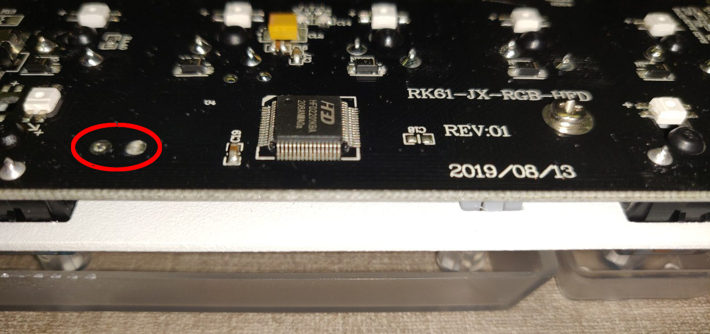

# RK61 RGB

Royal Kludge RK61 non-hotswap rgb edition, original PID 0x24F.

Tested on the Royal Kludge RK61 non-hotswap RGB dual-mode edition, original PID 0x24F
(RK61 firmware v1.03.000n, purchased after May 2020).

- MCU: HFD2201KBA (rebrand SN32F248BF)
- PCB: RK61-JX-RGB-HFD; REV: 01; 2019/08/13
- Wired only, no bluetooth support.

Keyboard Maintainer: [mr-july](https://github.com/mr-july)

For the white-backlit non-rgb version of the RK61, check out [Diff-fusion's repo](https://github.com/Diff-fusion/qmk_firmware)

Note: keymap differs slightly from stock firmware for FN combinations
configuring RGB settings. Also adds ability to control volume and display
brightness + additional FN keys.
See [keymap.c](keymaps/default/keymap.c), and refer to the [list
of QMK keycodes](https://beta.docs.qmk.fm/using-qmk/simple-keycodes/keycodes).

-----------------

Make example for this keyboard (after setting up your build environment):

    make royal_kludge/rk61/rgb:default

See the [build environment setup](https://docs.qmk.fm/#/getting_started_build_tools) and the [make instructions](https://docs.qmk.fm/#/getting_started_make_guide) for more information. Brand new to QMK? Start with our [Complete Newbs Guide](https://docs.qmk.fm/#/newbs).

## Bootloader

Enter the bootloader:

- [Sonix Flasher](https://github.com/SonixQMK/sonix-flasher): if you have the original firmware, just start the program and click the "Reboot to Bootloader [HFD]" button.
- Physical reset: short the two contacts to the left of the space bar switch with a wire/paperclip, accessible from the bottom of PCB.
  
  After shorting, just connect the USB cable. The keyboard started in bootloader mode and is ready to be flashed.
- Layout (after loading QMK): FN + CapsLock

## Flashing

### Option 1. SONiX USB MCU ISP Tool

Download the [SONiX USB MCU ISP Tool](https://www.sonix.com.tw/files/1/B6648B8BB74030BDE050007F01002479) from the [MCU SN32F248B page](https://www.sonix.com.tw/article-en-4336-30356) and use the program, included in archive.
More detailed instructions may be found in this [Video](https://youtu.be/2MHtLEiXaXg?t=940).

### Option 2. Sonix Flasher

Use the Python program from [this repository](https://github.com/SonixQMK/sonix-flasher)

### Option 3. SonixFlasherC

Use the C program from [this repository](https://github.com/SonixQMK/SonixFlasherC)

## Original firmware

### Unchanged

The original firmware can be found on [Google Drive](https://drive.google.com/drive/folders/1Qx_4Ql_n_4TafIpe-guBf9F-IfuuVHOy)

### Patched

There is a version of original firmware, which was patched to be able to start the keyboard in bootloader mode by holding the `Esc` button while connecting the USB cable. The patched files are available on [Dropbox](https://www.dropbox.com/sh/jy1741tsamyjt6a/AAA58nafcQ_wCTlKke11ck30a?dl=0).
With this firmware it is possible to switch from QMK to original firmware and back without shorting contacts on PCB.
